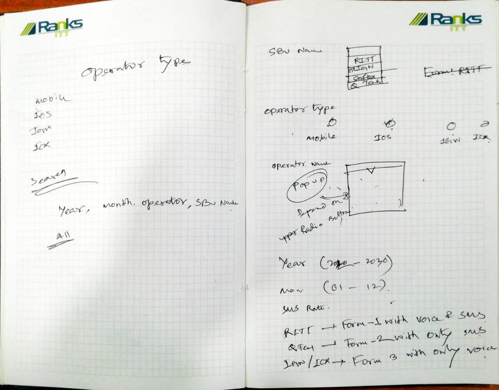

## Tasks:

### 2024-01-21



- [X] Operator Type (meta-data)
    - name ['Mobile', 'IOS', 'IGW', 'ICX']

- [ ] Operator (feature-update)
    - Operator Type

- [ ] Operator Bill (feature-update)
    - SBU (options)
    - Operator_Type (options)
    - Operator (depends on operator_type) (options)
    - Year (options)[2020 - 2030]
    - month (options)[1 - 12]
    - SMS Rate (no need)

```
RITT -> FORM {voice,sms}
QTECH -> FORM {sms}
RITIGW -> FORM {voice}
SOFTEX -> FORM {voice}
```

- [ ] Operator Bill Report Serch (feature-request)
    - SBN (options)
    - Operator (options)
    - year
    - month

---

### 2024-01-16

- [X] Operator Bills Report
    - year
    - month
    - client_name
    - client_address
    - successful_calls
    - effective_duration (minutes)
    - voice_amount
    - voice_amount_with_vat
    - sms_count
    - sms_rate
    - sms_amount
    - sms_amount_with_vat
    - file_upload

---

### 2023-12-24

-[ ] Upload Content:
    - set system date as date on form.
    - let user select created category.
    - On category Excel file headers should be:
        - aggregator_name
        - date
        - sender_no
        - destination_no
        - operator_name
        - sms_content
        - status

---

### 2023-12-18

-[X] Upload Content Excel File
    - With User Date

---

### 2023-12-12

-[X] Content Upload
    - progress-bar

-[X] Content List Filter:
    - *category[all,other_categories]{multi_select}
    - date-range
    - limit

---

### 2023-12-06

-[X] Create Category

-[X] Upload Content Excel File
    - *(MOBILE_NO and SMS_CONTENT)*
    - *MOBILE_NO* should be unique
    - Category should be selected from the list or create new category